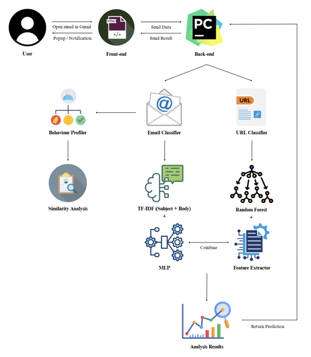

# 🛡️ PhishShield AI  
*A Behaviour-Based Anomaly Detection using Chrome Extension for Phishing Prevention in Emails*  

---

## 📌 Overview  
PhishShield AI is an intelligent phishing detection system that integrates **machine learning** and **behaviour-based anomaly detection** through a **Google Chrome extension**.  
It enhances email security by:  
- Analyzing **email metadata and content**  
- Extracting **phishing-related URL features**  
- Tracking **user behaviour anomalies** (e.g., unusual clicks, response times)  
- Providing **real-time alerts** with phishing explanations  

This project was developed as part of my **Final Year Project (B.Sc. Cyber Security, APU, 2025)**.  

---

## ✨ Key Features  
- 📩 **Email Content Analysis** – Detects suspicious keywords & phishing patterns using TF-IDF + MLP  
- 🔗 **URL Analysis Engine** – Extracts 16+ phishing-related features & predicts legitimacy using Random Forest  
- 👤 **Behaviour Profiling** – Identifies unusual user interaction patterns for anomaly-based detection  
- ⚡ **Real-Time Alerts** – Immediate warnings when phishing emails or links are detected  
- 🌐 **Chrome Extension** – Seamless integration with Gmail for easy access  
- 📊 **Detailed Reports** – Full breakdown of detection results with feature explanations and export options  

---

## 🏗️ System Architecture  


The system consists of:  
- **Frontend**: Chrome Extension (HTML, CSS, JS)  
- **Backend**: Flask (Python) with ML models & feature extraction  
- **Models**:  
  - Email Detection → TF-IDF + MLP Classifier  
  - URL Detection → Random Forest + Calibrated RF  
- **Supporting Modules**: Spam keyword highlighter, behaviour profiling, phishing reasoning, screenshot capture  

---

## 🚀 Installation & Setup  

### 1. Clone Repository  
```bash
git clone https://github.com/your-username/phishshield-ai.git
cd phishshield-ai
```

### 2. Backend Setup (Flask Server)  
```bash
pip install -r requirements.txt
python app.py
```

### 3. Load Chrome Extension  
1. Open Chrome → `chrome://extensions/`  
2. Enable **Developer Mode**  
3. Click **Load unpacked** → Select `chrome-extension` folder  

### 4. Start Detection  
- Launch backend (`app.py`)  
- Open Gmail → PhishShield AI will automatically analyze emails  

---

## 📂 Repository Structure  
```
phishshield-ai/
│── backend/
│   ├── app.py                # Flask server & API routes
│   ├── unified_predict.py    # ML-based email + URL prediction
│   ├── feature.py            # URL feature extraction
│   ├── behavior_profile.py   # Behaviour anomaly detection
│   └── ...
│
│── chrome-extension/
│   ├── manifest.json
│   ├── popup.html
│   ├── popup.js
│   ├── content.js
│   └── details.html
│
│── models/
│   ├── mlp_classifier_model.pkl
│   ├── tfidf_vectorizer.pkl
│   ├── random_forest.pkl
│   └── ...
│
│── requirements.txt
│── README.md
```

---

## 📊 Datasets Used  
- **URLs**: 16 phishing & legitimate datasets from Kaggle, GitHub, etc.  
- **Emails**: 13 phishing & spam email datasets  
- **Others**: Spam keywords list, Alexa Top domains, suspicious TLDs  

*(See report for detailed dataset documentation.)*  

---

## 🧪 Model Performance  
- **URL Detection (Random Forest)**: ~95% Accuracy  
- **Email Detection (MLP + TF-IDF)**: ~93% Accuracy  
- **Combined Detection**: High precision with reduced false positives  

---

## 📸 Screenshots  
| Gmail Highlighting | Popup Extension | Detailed Report |
|--------------------|-----------------|----------------|
|     |   |  |

---

## 🛠️ Tech Stack  
- **Frontend**: HTML, CSS, JavaScript (Chrome Extension)  
- **Backend**: Python, Flask  
- **Machine Learning**: Scikit-learn, Pandas, NumPy  
- **APIs**: Google Safe Browsing API, VirusTotal API  
- **Other Tools**: Selenium (screenshot), Joblib (model persistence)  

---

## 📖 Research Context  
This project was developed as part of my **Final Year Project (FYP)** for the degree:  
**B.Sc. (Hons) Cyber Security, Asia Pacific University of Technology and Innovation (APU), 2025**.  

Supervised by: *Mr. Mohd Hanis Jenalis*  

---

## 📜 License  
This repository is released under the **MIT License**.  
